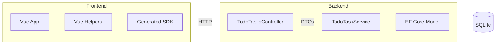

# Eric's Todo App 😊

## Technical Design




### My choices
- Use openAPI SDK generator to generate a client side SDK based on the current openAPI (see dev notes below). This prevents the headache of updating manually updating a Frontend - Backend contract) 
- Have the service return and accept DTOs from the controller to keep things more modular / less dependant.
- Create `TodoHelper` with CRUD methods (`add`, `delete`, `toggleDone`) to make the Vue presentation layer easier to read.
- To make things snappy, use an "Optimistic add" where todo list items are added before the server actually creates them, and only removed if there is no 200)

## Out of scope for now
- More comprehensive tests :)
- Integration tests
- Logging
- Performance monitoring
- Advanced features like:
  - User accounts
  - Collaborative todo-ing
  - offline use (this is actually pretty important to have, i.e. the user should be able to create items without internet which would be synced at a later date, still out of scope for me now thoug)
- App size optimization, should setup webpack with cdn or something. Lighthouse score is currently terrible

## Setup

### 1. Check Prerequisites
- .NET SDK 10
- dotnet-ef ( `dotnet tool install --global dotnet-ef`)
- Node 18+

### 2. Run backend (dot net api)

```bash
cd server/eztask-server
dotnet ef database update
dotnet restore
dotnet run
```

- Swagger UI: http://localhost:5114/swagger  


### 3. Run frontend (vue via vite)

```bash
cd client
npm install
```

~Create `client/.env`:~ (i left `.env` in the repo to make one less step for this demo)

```env
API_BASE_URL=http://localhost:5114
```

Start dev server:

```bash
npm run dev
```
### 4. Open app

http://localhost:5173/


## Useful development commands

### Generate the client side sdk from openApi docs

```bash
cd client
npm i openapi-fetch
npm i -D openapi-typescript
npx openapi-typescript http://localhost:5114/swagger/v1/swagger.json -o src/api/schema.d.ts
```

The client wrapper lives in `src/api/client.ts` and uses the generated types.

Regenerate types whenever the .NET DTOs or routes change.
